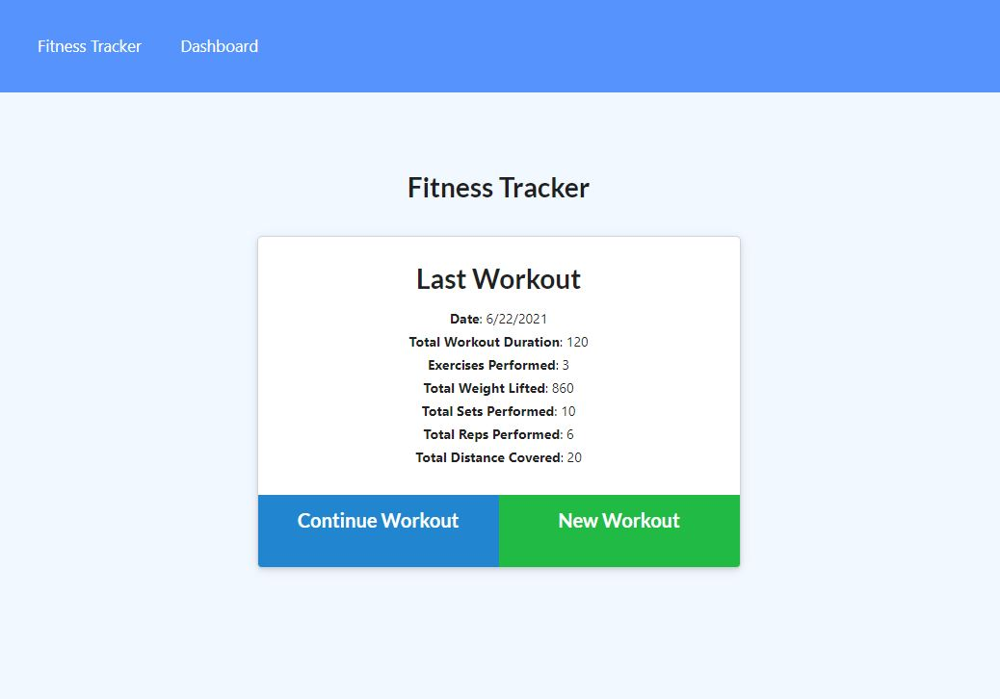

# Workout Tracker

# Table of Contents 

1. [Description](#description)
2. [Installation](#installation)
3. [Usage](#usage)
4. [Demo](#demo)
5. [Questions](#questions)

## Acceptance Criteria:

When the user loads the page, they should be given the option to create a new workout or continue with their last workout.

The user should be able to:

    * Add exercises to the most recent workout plan.
    * Add new exercises to a new workout plan.
    * View the combined weight of multiple exercises from the past seven workouts on the stats page.
    * View the total duration of each workout from the past seven workouts on the stats page.

## Description:

For this homework assignment, I was tasked with creating a workout tracker that will allow the user to view, create and track their daily workouts. The user should be able to log multiple exercises in a workout on a given day. The user will be able to keep track of their last workout such as the amount of exercises they performed, total weight that was lifted, total sets and reps perform and the total distance they covered. Within the dashboard, the user will be able to see a 7-day chart showing their workout duration in minutes and also the total amount of pounds they lifted.

## Installation:

To run this application, the following installs will be required:

        * node.js
        * node_modules
        * express
        * mongoose
        

## Usage:

This is intended to be used to keep track of a person's daily workout.

The following link will take you to the deployed application:
    
* https://salty-earth-89303.herokuapp.com/?id=60d298f85ff41d025365db99

## Demo:
The following link is a video that will showcase how to run the application.

* https://www.youtube.com/watch?v=N0Pljo3weMQ

## Questions: 
If there are any questions that you may have, please contact me by the following:

* Github: https://github.com/vickphat
* Email: vickphat@gmail.com 
